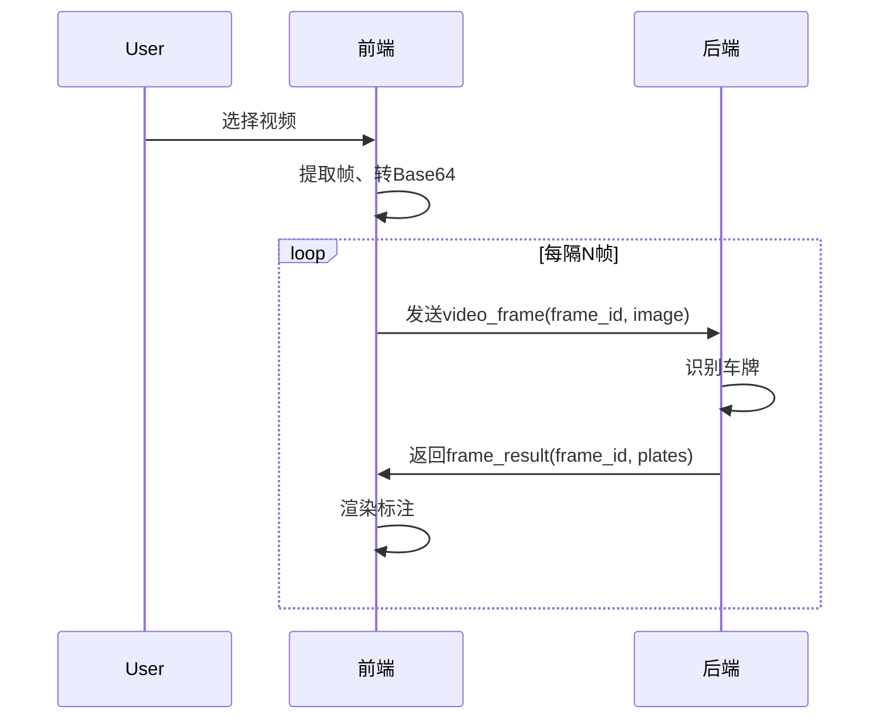

# 视频及其他功能扩展开发文档

---

## 1. 视频车牌识别功能详细设计

### 1.1 功能目标
- 支持用户选择本地视频文件，自动或手动提取视频帧进行车牌识别。
- 实时展示视频播放、帧标注、识别结果。
- 支持播放/暂停、帧步进、进度条、识别进度提示。

### 1.2 前端设计（鸿蒙ArkTS）

#### 1.2.1 主要组件与服务
- `VideoService`：负责视频选择、帧提取、PixelMap转Base64、帧控制。
- `VideoPlayer`：UI组件，负责视频播放、帧步进、进度条、与标注叠加。
- `PlateAnnotatorCanvas`：在视频帧上绘制车牌框和文字。
- `WebSocketService`：扩展支持`video_frame`和`frame_result`消息。
- `VideoPage`/`Index`：主页面，组织UI和状态管理。

#### 1.2.2 关键API与伪代码

- **视频选择**
  ```typescript
  import picker from '@ohos.file.picker';
  let picker = new picker.FilePicker();
  picker.suffix = ['mp4', 'avi', ...];
  let result = await picker.show();
  let videoPath = result[0];
  ```

- **帧提取**
  ```typescript
  import { media } from '@kit.MediaKit';
  let avImageGenerator = await media.createAVImageGenerator();
  avImageGenerator.fdSrc = videoFd;
  let pixelMap = await avImageGenerator.fetchFrameByTime(timeUs, queryOption, param);
  avImageGenerator.release();
  ```

- **帧循环提取**
  ```typescript
  for (let t = 0; t < durationUs; t += intervalUs) {
    let pixelMap = await getVideoFrameAt(t, fd);
    let base64 = await pixelMapToBase64(pixelMap);
    webSocketService.sendVideoFrame(base64, frameId);
  }
  ```

- **WebSocket消息协议**
  - 发送：
    ```json
    {
      "type": "video_frame",
      "data": { "frame_id": 123, "image": "<base64>" },
      "timestamp": 1678886400000
    }
    ```
  - 返回：
    ```json
    {
      "type": "frame_result",
      "data": { "frame_id": 123, "plates": [ ... ] },
      "timestamp": 1678886401000
    }
    ```

#### 1.2.3 状态管理与UI
- 当前视频路径、播放状态、当前帧号、识别进度、帧与识别结果的映射。
- UI包括：视频播放器、帧标注区、识别结果列表、进度条、控制按钮。

#### 1.2.4 注意事项
- 帧提取API兼容性，必要时用截图模拟。
- 帧率建议1-2fps，防止卡顿。
- 结果与帧严格用frame_id绑定。
- 资源释放及时，避免内存泄漏。

### 1.3 后端设计（Python Flask）

#### 1.3.1 WebSocket协议扩展
- 新增`video_frame`类型消息，返回`frame_result`。
- 每帧独立处理，带frame_id，结果与前端同步。

#### 1.3.2 处理流程
- 收到`video_frame`，解码图片，调用`recognize_plate`。
- 返回`frame_result`，包含frame_id和plates数组。
- 支持异步/多线程，防止阻塞。
- 可设置最大并发帧数、超时、丢帧等策略。

#### 1.3.3 推荐数据结构
- 见前端协议示例。

#### 1.3.4 性能与健壮性
- 支持动态调整帧率。
- 日志记录frame_id，便于追踪。
- 错误处理完善，防止单帧异常影响整体。

---

## 2. 其他功能扩展设计

### 2.1 识别历史与导出
- 本地存储识别历史（图片/视频、时间、结果）。
- 支持查询、筛选、导出（CSV、Excel、图片等）。
- 推荐接口：
  - `saveHistory(record)`
  - `getHistoryList(filter)`
  - `exportHistory(format)`

### 2.2 交互与UI优化
- 视频播放支持快进快退、帧步进、缩放、拖动。
- 识别结果可点击查看详情。
- 支持多语言、主题切换。

### 2.3 性能与健壮性提升
- 前端：帧提取异步、缓存优化、UI防卡顿。
- 后端：异步处理、超时丢帧、结果缓存。
- 前后端：带宽自适应、错误重试、断点续传。

### 2.4 参考与创新
- 参考OpenALPR、YOLO+OpenCV等主流项目。
- 支持端云结合、智能帧选取、多帧融合。
- 持续优化算法与用户体验。

---

## 3. 典型调用流程图



--- 
